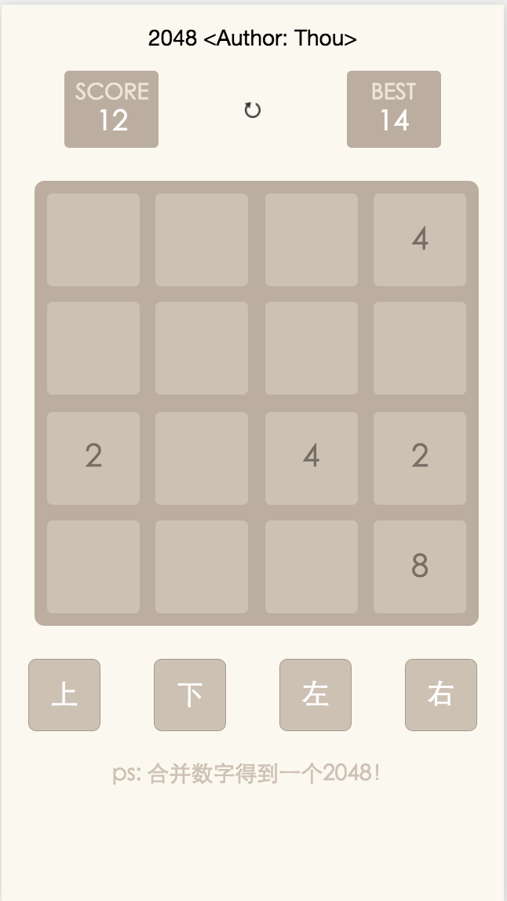

# 微信小程序实现1024小游戏

### 项目说明:
微信不愧是业界大拿，小程序还处于内测阶段就有了如此声势。心痒痒也手写了一个简单的练手Demo。项目只有一个页面，简单的实现了1024的游戏规则。

### 使用说明:
1.clone或download项目到本地

2.打开微信小程序，选择添加项目

3.选择无AppID即可，项目名随意添加，然后指向项目根目录

	
### 开发环境:
微信web开发者工具 v0.9.092300

Sublime Text

OSX 10.11.6