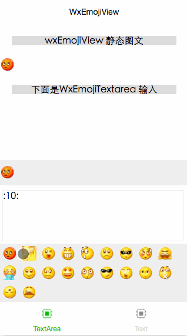

## 来源信息

 * author: Di (微信小程序开发工程师)
 * organization: WeAppDev(微信小程序开发论坛)(http://weappdev.com)
 *               垂直微信小程序开发交流社区
 * github地址: https://github.com/icindy/WxEmojiView
 * 作用: WxEmojiView-微信小程序Emoji展示输入组件
 * detail : 
 * version: `alpha 0.1 非正式版` 

## 效果gif(加载慢.... 请等待...)



## 作用

* 用于展示带有emoji的文本信息
* 用于输入和带有emoji的输入框

## 使用

* 拷贝`WxEmojiView\`文件夹到开发目录下
* 替换`WxEmojiView`文件夹下的`emojis`文件夹下的小表情图片
* 初始化表情
> 可以在`app.js`中进行配置，全局使用，也可单独配置使用
 
   + 初始化函数`WxEmoji.init(reg,emojis)`
   reg: 分割符号
   emojis： 配置表情key-value(名称和后面的必须一致，否则失效，没有写转化函数)

   + 使用代码 
```
var WxEmoji = require('WxEmojiView/WxEmojiView.js');
App({
  onLaunch: function () {
    WxEmoji.init(":_/",{
      "00":"00.gif",
      "01":"01.gif",
      "02":"02.gif",
      "03":"03.gif",
      "04":"04.gif",
      "05":"05.gif",
      ....
    });
  }
})
```

* 引入到需要使用的地方
如在`index.js`中进行使用

  + 需要进行函数引入
  `var WxEmoji = require('../../WxEmojiView/WxEmojiView.js');`

  + 如在index.wxml中使用
  `<import src="../../WxEmojiView/WxEmojiView.wxml"/>`

* 模版使用

  + view对文本进行展示 使用模版`WxEmojiView`模版
  ```
    <view style="text-align: center;margin: 20px;background-color: #ddd;">wxEmojiView 静态图文</view>
<template is="WxEmojiView" data="{{WxEmojiObjs}}"/>
  ```

 + 使用textarea进行输入展示 使用`WxEmojiTextarea`模版

   ```
   <view  style="text-align: center;margin: 20px;background-color: #ddd;">下面是WxEmojiTextarea 输入</view>
<template is="WxEmojiTextarea" data="{{WxEmojiObjs}}" />
   ```
* textarea组件的focus,blur事件绑定，小图标的点击事件(仅用于textarea的时候)

```
  WxEmojiTextareaFocus:function(e) {
    var that = this;
    WxEmoji.WxEmojiTextareaFocus(that,e);
    
  },
  WxEmojiTextareaBlur:function(e){
    var that = this;
    WxEmoji.WxEmojiTextareaBlur(that,e);
  },
  wxPreEmojiTap: function(e){
    var that = this;
    WxEmoji.wxPreEmojiTap(that,e);
  }
```

## 问题

目前版本还存在很多问题，所以欢迎提交isssue

## 来源

> 本项目由[微信小程序开发论坛-WeAppDev](http://weappdev.com/) [http://weappdev.com/](http://weappdev.com/) 会员编写