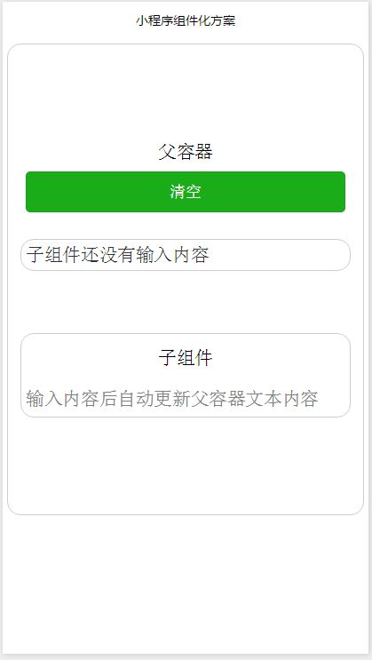

微信小程序组件化方案示例
=====================
> 由于微信小程序中只提供了template，而template仅仅是视图模板，我们其实想要的组件是包含视图（wxml和wxss）和逻辑(js)的。网上有第三方框架可以组件化，但是看了看，好复杂。而且结合到我们项目中，由于有1M的限制，实在无法过多使用第三方框架了。所以，有了下文。。。如果哪位大神有更好的方案，欢迎交流。

其实原理很简单，就是合并。做法分三步：
- 子组件的wxml作为模板include到父容器中
- 子组件的wxss import到父容器的wxss中
- 把父容器的data和方法与子组件的data和方法合并（注意：合并的data及方法名不能重名）

### 看看效果：
在子组件的input框中输入内容，父容器中显示input的内容，父容器中点击清空按钮后子组件input内容清空。




## 详细说明
### 组件部分

#### 1.js部分把data及方法export出去供调用侧使用。
```javascript
module.exports = {
    data: {
        childInputVal: ''
    },
    inputChange: function(event) {
        let inputVal = event.detail.value;
        this.setData({
            childCompVal: inputVal,
            childInputVal: inputVal
        });
    }
}
```
详细代码： [components/myComponent/index.js](./components/myComponent/index.js)

#### 2.wxml部分。
```html
<view class="component-container">
    <view class="desc">子组件</view>
    <input 
        value="{{childInputVal}}"
        placeholder="输入内容后自动更新父容器文本内容"
        bindinput="inputChange" />
</view>
```
详细代码： [components/myComponent/index.wxml](./components/myComponent/index.wxml)

#### 3.wxss部分
```css
.component-container{
    width: 90%;
    height: 30%;
    border: 1px solid #cdcdcd;
    border-radius: 15px;
    padding: 5px;
    margin-top: 70px;
}
.desc{
    margin-top: 10px;
    text-align: center;
}
input{
  width: 100%;
  margin-top: 20px;
}
```
详细代码： [components/myComponent/index.wxss](./components/myComponent/index.wxss)

### 父容器部分

#### 1.容器中wxml部分

在wxml中include上面的wxml
```html
<view class="container">
  <text>父容器</text>
  <view class="button-container">
    <button bindtap="clearInput" type="primary" size="default" >清空</button>
  </view>
  <view class="value-container">
    {{childCompVal}}
  </view>
  <!-- 引入子组件wxml -->
  <include src="../../components/myComponent/index.wxml" />
</view>
```
详细代码： [pages/index/index.wxml](./pages/index/index.wxml)

#### 2.容器中wxss部分

在wxss中import上面的wxss文件
```css
.button-container {
  margin-top: 10px;
  width: 90%;
}

.value-container {
  margin-top: 30px;
  width: 90%;
  padding: 5px;
  border: 1px solid #cdcdcd;
  border-radius: 15px;
  color: #333;
}

/** 引入子组件样式 **/
@import "../../components/myComponent/index.wxss"
```
详细代码： [pages/index/index.wxss](./pages/index/index.wxss)

#### 3.容器中js部分

1.引入子组件的js文件
```javascript
var myComponent = require('../../components/myComponent/index');
```

2.把原来Page({...})中的代码移出
```javascript
    // 原来
	Page({
		data：{
			data1: 'data1',
			data2: 'data2'
		},
		func1: function() {...}
	});

    // 改成
    var pageObj = {
		data：{
			data1: 'data1',
			data2: 'data2'
		},
		func1: function() {...}
	};
    Page(pageObj);
```
3.在调用Page(pageObj)之前，把引入的共通内容合并到进pageObj中
```javascript
    for (let compKey in compObj) {
        if (compKey == 'data') {
            // 合并页面中的data
            let data = compObj[compKey];
            for(let dataKey in data) {
                pageObj.data[dataKey] = data[dataKey];
            }
        } else {
            // 合并页面中的方法
            pageObj[compKey] = compObj[compKey];
        }
    }
	Page(pageObj);
```
详细代码： [pages/index/index.js](./pages/index/index.js)