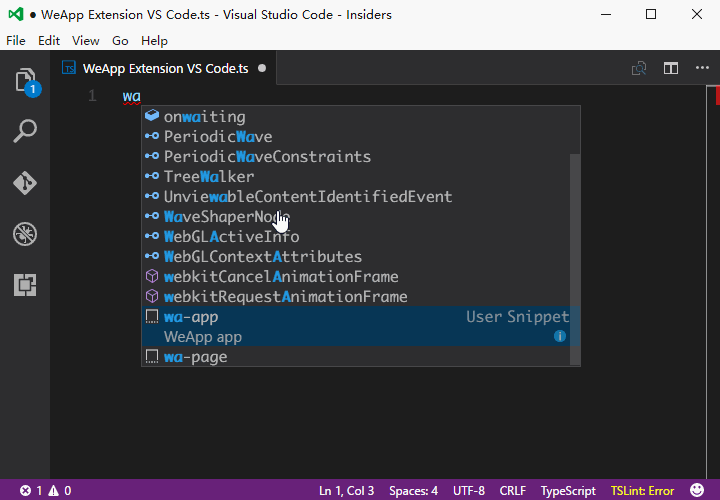

# WeApp Extension for VS Code
> VS code extension for WeApp development  
> 微信小程序插件 for [TypeScript](#typescript) / [wxml](#wxml) / [config json](#json)

## Welcome
It's nice to see you here getting this extension, cause you're using or gonna use the *GREAT* **[TypeScript](http://www.typescriptlang.org)** to develop your WeApp  
You can aslo take advantage of this extension for `wxml` and `json` even if you are using javascript

BTW: you can get the TypeScript declaration file for WeApp API using [`typings`](https://github.com/typings/typings)  

```batch
typings install env~we-app -SG
```
Or  

```batch
typings install github:Emeryao/typed-we-app -SG
```

## Contact Me
Please feel free to contact me via [email](mailto:luyao1206@live.cn) or Github [issue](https://github.com/Emeryao/we-app-vscode/issues)

## Snippets
> prefix **`wa-`** stands for WeApp  
> based on the official WeApp [documentation](https://mp.weixin.qq.com/debug/wxadoc/dev/index.html)

### [TypeScript](http://www.typescriptlang.org/)
* **`wa-page`** :
```typescript
    let mainPage;
    let param: PageParam = {
        data: {
            message: 'hello world'
        },
        onLoad: function () {
            mainPage = this;
        }
    };
    Page(param);
```
 

* **`wa-app`** :
```typescript
    let param: AppParam = {
        onLaunch: function () {

        },
        onShow: function () {

        },
        onHide: function () {

        }
    };
    App(param);
```
 

### wxml

|snippets|output|
|--------|--------|
|`wa-block`|`<block></block>`|
|`wa-view`|`<view></view>`|
|`wa-scroll-view`|`<scroll-view></scroll-view>`|
|`wa-swiper`|`<swiper></swiper>`|
|`wa-swiper-item`|`<swiper-item></swiper-item>`|
|`wa-icon`|`<icon></icon>`|
|`wa-text`|`<text></text>`|
|`wa-textarea`|`<textarea></textarea>`|
|`wa-progress`|`<progress></progress>`|
|`wa-button`|`<button></button>`|
|`wa-checkbox-group`|`<checkbox-group></checkbox-group>`|
|`wa-checkbox`|`<checkbox></checkbox>`|
|`wa-form`|`<form></form>`|
|`wa-input`|`<input></input>`|
|`wa-label`|`<label></label>`|
|`wa-picker`|`<picker></picker>`|
|`wa-radio-group`|`<radio-group></radio-group>`|
|`wa-radio`|`<radio></radio>`|
|`wa-slider`|`<slider></slider>`|
|`wa-switch`|`<switch></switch>`|
|`wa-navigator`|`<navigator></navigator>`|
|`wa-audio`|`<audio></audio>`|
|`wa-image`|`<image></image>`|
|`wa-video`|`<video></video>`|
|`wa-map`|`<map></map>`|
|`wa-canvas`|`<canvas></canvas>`|

### JSON  

* wa-page
* wa-app-window
* wa-app-page
* wa-app-tab
* wa-app-network
* wa-app-debug

## Where to get

* Extension@[Visual Studio Marketplace](https://marketplace.visualstudio.com/items?itemName=emeryao.we-app-vscode)
* Source@[Github](https://github.com/Emeryao/we-app-vscode)

## Last Update
2016.11.11
