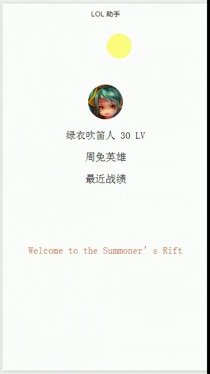

## Welcome to the Summoner’s Rift

欢迎来到召唤师峡谷！

如果你也沉浸在岩雀挥舞着衣袖从泉水跳着走出去的欢呼雀跃中，如果你也在 Gank 或者被 Gank 的地形中发现了孤独的生物 Leave and Return to the Void，一次次期待久别重逢时，那么来召唤师峡谷~~打一局（划掉）~~写写小程序吧。

## 接口

Riot Games 不提供国服游戏数据的 API 接口，只能使用[第三方平台](http://api.games-cube.com/)的接口。先到这个平台注册，获取一个只能维持一天的 Token，将 Token 写在 Get 方法的 HTTP Header 中去请求数据。

## 目录

```
.
|-- app.js
|-- app.json
|-- app.wxss
|-- assets
|   `-- demo.gif
|-- pages     
|   |-- index   # 主页
|   |   |-- index.js
|   |   |-- index.wxml
|   |   `-- index.wxss
|   `-- legends # 查询周免页
|   |   |-- legends.js
|   |   |-- legends.json
|   |   |-- legends.wxml
|   |   `-- legends.wxss
|   `-- battles # 查询战斗页
|   |   |-- battles.js
|   |   |-- battles.json
|   |   |-- battles.wxml
|   |   `-- battles.wxss
`-- utils       # 工具
    `-- util.js
```

## Demo



