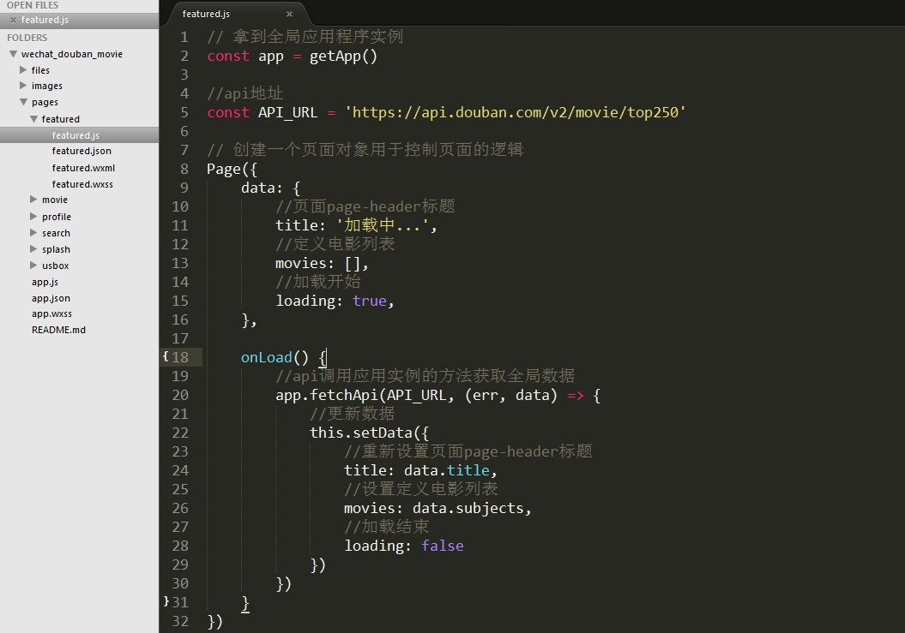
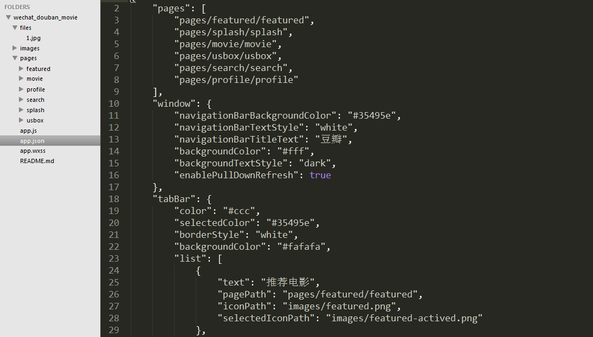
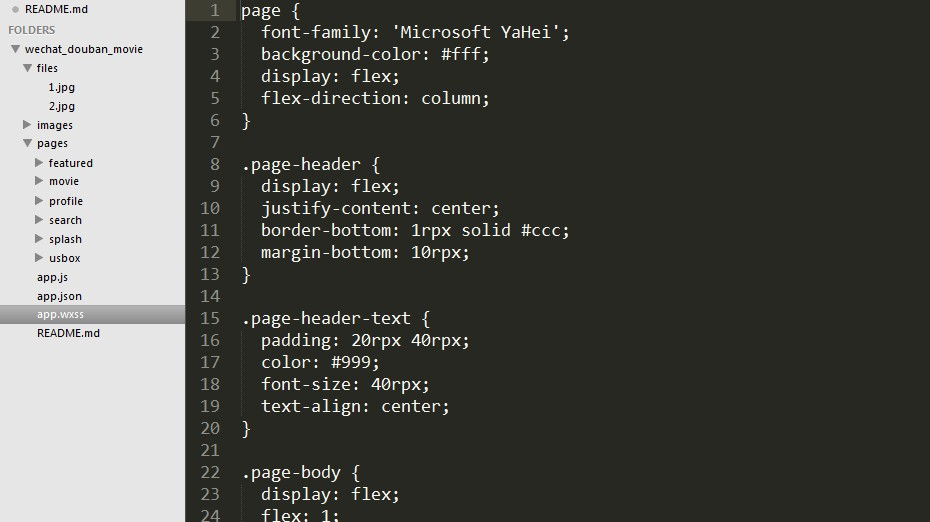
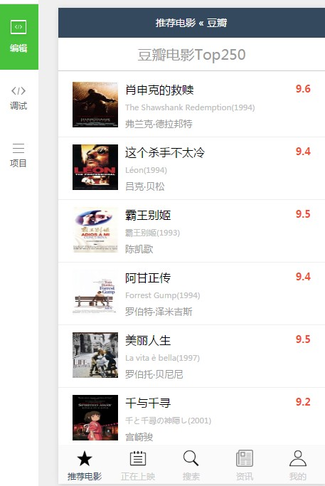
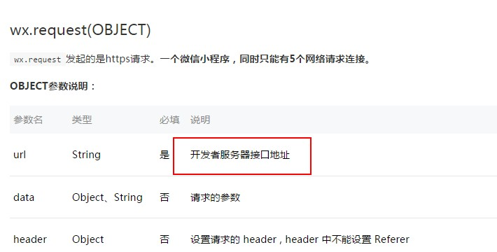
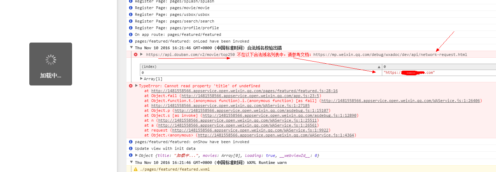

## 微信小程序-豆瓣电影-测试案例

#### 1、app.js 封装请求方式函数 fetchApi



#### 2、app.json 配置文件(配置页面样式、多少页面、菜单按钮)


#### 3、app.wxss 全局样式文件（定义页面的全局样式）


#### 4、效果图


#### 5、填入appid后保错说明


```
注意：
	小程序请求的接口域名必须是在微信小程序管理平台绑定的域名，
	你不能直接请求第三方接口，只能通过你绑定的域名去请求第三方接口给到小程序，
	否则会报错！
```
##### 项目地址：
[http://phpxiong.cn/article/show/41](http://phpxiong.cn/article/show/41 "豆瓣电影")

##### 参考项目：
[豆瓣电影](https://github.com/zce/weapp-demo/tree/backup "豆瓣电影")

##### 官方文档：
[官方文档](https://mp.weixin.qq.com/debug/wxadoc/dev/ "官方文档")

```
说明：代码中已有大量的注释！
```