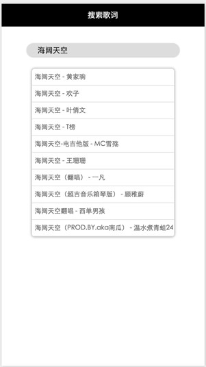
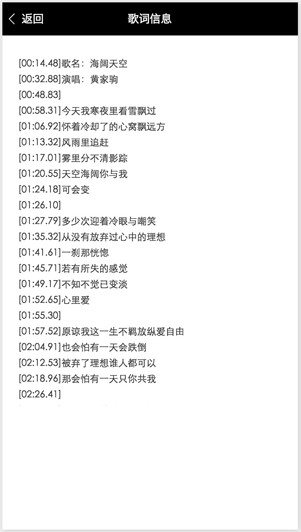

# 微信小程序demo－搜索歌词
###小程序的简单demo
本demo有两个页面，分别是歌曲的搜索页和歌词的搜索结果页，调用接口是百度音乐API接口

```
搜索歌曲接口
http://tingapi.ting.baidu.com/v1/restserver/ting?method=baidu.ting.search.catalogSug&query=海阔天空
参数：query = 搜索关键字
```

```
搜索歌词接口
http://tingapi.ting.baidu.com/v1/restserver/ting?method=baidu.ting.song.lry&songid=877578
参数：songid = 歌曲id
```





