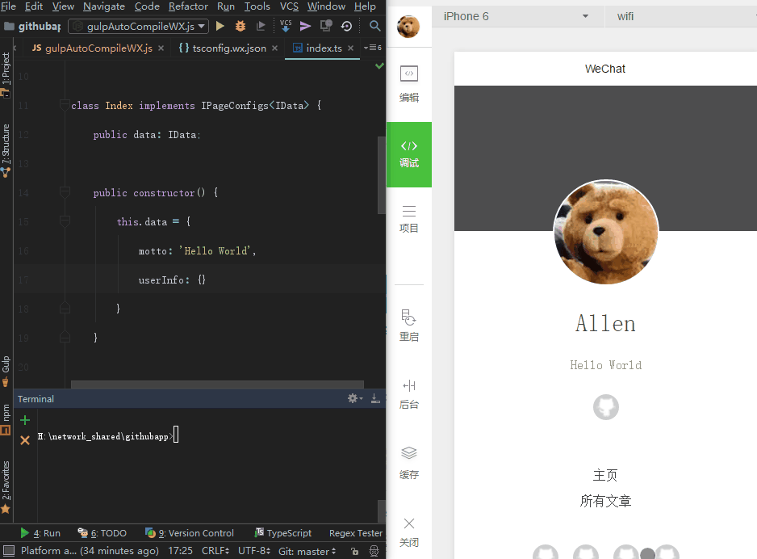

# WX Compile key

[](https://www.npmjs.com/package/wx-compile-key)

这是一个微信小程序的辅助工具， 作用很简单， 只是一个简单的hack， 改了一下他的源码， 把微信小程序编译的快捷键变成了全局。
快捷键默认设置为**control+alt+shift+f10**。（**不满足？那给你弄一个gulp和webpack让你自动保存自动编译吧**）
[Gif成功样例](#成功样例)


## 目的

其实这一个只是gulp-wx-compile的插件之一， 目的很简单， 让微信小程序变得跟webpack或者gulp一样， 当我们保存自己的代码， 小程序就自动编译，
感觉跟browser sync一样， 提高我们开发效率。

## 思路
以前做过游戏脚本开发，所以尝试通过窗口句柄发送ctrl+b（默认微信小程序编译快捷键）来隐式编译， 但在非激活窗口状态下可以发送单个快捷键但
无法发送组合快捷键， 这样当我们边写代码边保存的时候由于需要激活微信窗口会导致失焦的问题，所以放弃这个最简单也最优的方式。
如果有大大能解决， 欢迎给我留言。

这里选择第二种方式， 通过研读小程序的源码发现编译只是触发一个dispatch rebuild的方法（微信小程序也用到了redux）而且是基于nw.js开发的， 所以由此观察得出一个结论， 
我只需要为他注册一个全局的热键并绑定dispatch rebuild即可。

## 安装

```shell
npm i wx-compile-key@1.0.3 -g

wx-compile-key  ##这句话必须要在管理员模式下执行， 因为微信小程序的文件都是限定了修改权限的
```

## Gulp 使用
```javascript
npm i wx-compile-key --save-dev

const autoCompileGulpTask = require('wx-compile-key').autoCompileGulpTask;

gulp.task(`wx:autoCompile`, autoCompileGulpTask);
```

## Webpack Loader
(未完成测试，暂不公开)

## 环境
测试环境在**微信Web开发者工具0.9.092300**

> 兼容Windows

> Mac/Linux代码兼容但没有测试，欢迎小伙伴测试

## 测试用例
由于时间关系， 只是做了e2e测试， 后续有时间会补上单元测试。 问题应该不大， 如果遇到任何问题，
请open issue，我尽可能在当天给您解答，一下是所有的e2e测试用例截图：

### 成功用例
当看到添加全局热键成功后可以使用ctrl+alt+shift+f10编译小程序。
例如你在自己Vscode开发的时候， 写完代码， 顺便按这个快捷键编译一下。



### 已添加
说明wx-compile-key的命令已经使用过。



### 非法路径
输入不合法路劲时，弹出一下提示， 重新输入一个合法路劲即可。





### 路径不存在
路径输入正确，但并非微信小程序的根目录，重新定位目录即可。



## 成功样例
在开发阶段， 顺便按一下gulp/webpack监听就可以自动修改代码自动编译微信小程序啦。



## 反馈
1. 由于微信小程序没有稳定，而且由于这只是一个辅助工具，并没有花太多时间去完善，部分功能没有用智能方式去获取。如果有任何bug欢迎留言。
2. 如果有什么定制功能需要我完善，也可以留言。

## Licensing
MIT license
