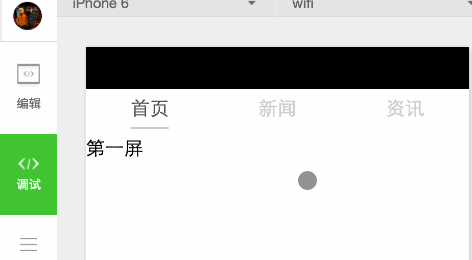
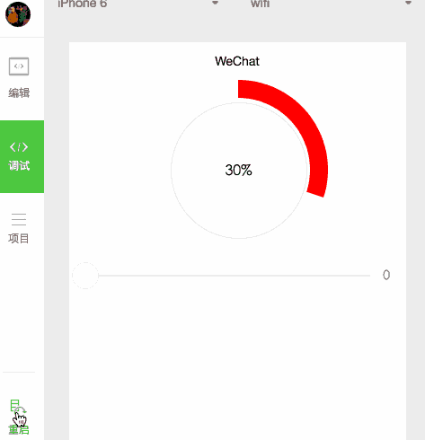

## 一步步开发微信小程序

微信小程序开发QQ群：589408404

* Demo1 项目目录结构 -- 主体文件
* Demo2 项目目录结构 -- 页面
* Demo3 创建一个小Demo -- slider小Demo
* Demo4 创建动画 -- 超酷圆形进度条

### 补充一些资料

目前而言，小程序很难写一个自定义组件，群里有人进行了一些常识：

[微信小程序自定义组件和事件传递](https://segmentfault.com/n/1330000007037416)

关于小程序，很多人有认识的错误，看下这个扫盲的文章：

[微信小程序，大多数人都搞错的八个问题](http://geek.csdn.net/news/detail/104430)

### 目录结构示例

> Demo2

练习swiper：通过swiper实现多tab的切换页面：

> Demo3

练习slider：通过slider实现简单的输入、选择交互效果

> Demo4

练习animation，创建动画

