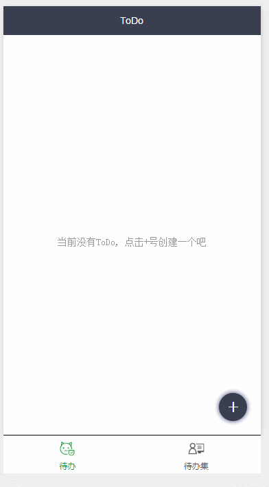

# 微信小程序 ToDoList

## 说明书

1. 新增ToDo，目前只有[5, 25, 35]的时间选择，以后将可以自定义时间
2. 在进行todo时，`header`目前是写死了，我写了五条名言随机出现，以后将增加更多或者直接进行网络请求
3. ToDos(待办集)目前还没开发(因为我也没使用过待办集，嘻嘻~~~)
4. 导航
  ``` 
    1. todo(首页)
    2. doing(进行页)
    3. todos(待办集页)
    4. logs(日志页)
  ```

## 开发遇到的问题

1. 首先就是页面间的跳转问题，*并不知道该用如何以正确姿势来使用*，看了官方文档只发现到导航，并使用了，结果差强人意
2. 组件的控制，发现没有DOM(可能是我没找到吧)，好多效果都没有实现
3. 倒计时动画，使用了wx.createAnimation，当然让我很不爽，问题应该出自二
4. placeholder-(style|class)和按钮的hover-class不起效，估计是姿势不对

---

## 暂时的效果图



---

## 学习资料

1. [官方文档](https://mp.weixin.qq.com/debug/wxadoc/dev/index.html)
2. [设计指南](https://mp.weixin.qq.com/debug/wxadoc/design/index.html)
3. [开发工具](https://mp.weixin.qq.com/debug/wxadoc/dev/devtools/download.html?t=1474644089359)